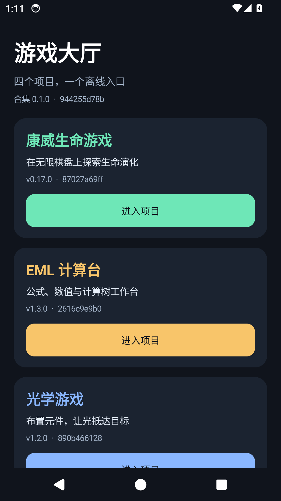

# 游戏大厅

一个离线 Android 应用，把康威生命游戏、EML 计算台、光学游戏和图灵机实验台装进同一个 APK。Android 原生首页显示四个项目及实际资源版本；游戏网页资源内置，离线可用。v0.3.0 支持启动更新提醒与四游戏独立资源更新。

**v0.4.0 已发布。** 从 [GitHub Releases](https://github.com/xiaoxuhui/game-hub/releases/latest) 下载正式签名的 `game-hub.apk`。CI 的调试 APK 仅用于检查和测试；未签名 Release 构建不能直接安装。最终同证书 v0.3.0→v0.4.0 五页存档及旧/新客户端公开通道已在任务模拟器验证；匿名八资产、APK内生产公钥和完整Release绑定通过，见[发行记录](doc/evidence/n5-v040-release-20261009.md)。真机由用户发行后安装验收，两类签名密钥异机备份按授权列入待办。

v0.4.0 已正式发布，v2 目录序列 3 提供阿贝尔沙滩 0.1.2、Lambda 线路实验室 0.3.0 和自有配对示范 1.0.1，无需更换大厅 APK。[两新游戏发行验收](doc/evidence/n7-two-game-release-20261009.md)记录实际启动提醒、安装、离线恢复及原生文件往返。用户可从“游戏目录”主动安装兼容的新游戏，安装后加入首页；已安装游戏按设置自动更新，移除资源保留存档且不会自动重装。动态游戏各有稳定独立 origin，四个旧游戏保留原存储位置。实际验证与待执行门禁见[v0.4.0 测试报告](doc/测试报告-v0.4.0.md)和[发行就绪度审计](doc/开源就绪度审计-v0.4.0.md)。



[四个项目的模拟器截图与测试范围](doc/测试报告.md)。

## 固定来源

四个项目的完整 Git SHA、只读工作树基线与构建方式见 [来源基线](doc/来源基线.md) 和 [`sources.lock.json`](sources.lock.json)。构建脚本按 SHA 重新检出到独立目录，生成的资源清单逐文件记录 SHA-256。原四仓库不参与写入或构建。

| 项目 | 合集入口 | 版本 |
|---|---|---|
| 康威生命游戏 | `games/conway/index.html` | 0.17.0 |
| EML 计算台 | `games/eml/eml-workbench.html` | 1.3.0 |
| 光学游戏 | `games/light/index.html` | 1.2.0 |
| 图灵机实验台 | `games/turing/index.html`、`campaign.html` | 0.5.0 |

## 在独立检出中构建

需要 Node.js 24、pnpm 11.19、JDK 17、Android SDK 34，以及可访问四个来源仓库的 Git。以下命令必须在新检出的工作目录执行；不要在四个原游戏仓库或本仓库的开发工作树运行构建。

```bash
git clone https://github.com/xiaoxuhui/game-hub.git game-hub-build
cd game-hub-build
pnpm install --frozen-lockfile
pnpm run check
pnpm run bundle
pnpm run verify:bundle
pnpm run audit:storage
cd android
./gradlew testDebugUnitTest assembleDebug
```

调试 APK 位于 `android/app/build/outputs/apk/debug/app-debug.apk`。GitHub Actions 的 [Android 检查](.github/workflows/android-check.yml) 运行同类步骤，并上传调试 APK 与摘要；[Android 模拟器烟测](.github/workflows/android-emulator-smoke.yml) 可手动运行，验证四入口和返回大厅，并上传截图与 UI 层级。工作流不会发布。资源组装完成前，`audit:storage` 没有输入，需按上述顺序运行。`pnpm run bundle` 只接受干净的独立检出，防止把开发中未提交的文件误打进 APK。

## 使用与数据

在首页进入项目；系统返回键优先返回当前项目的上一网页，随后回到大厅。文件导入使用系统选择器，导出使用系统“创建文档”界面。四个项目共享 WebView origin，固定来源中已知的存储键互不相同，但路径不构成数据隔离。旧版独立 APK 的私有数据不会自动迁移；可迁移的内容见 [迁移说明](doc/迁移说明.md)。

v0.2.0 通过“检查更新”手动查询正式 APK。v0.3.0 在打开大厅时异步查询正式 APK 和独立签名资源目录，离线仍可进入游戏；设置默认允许非计费 Wi-Fi 自动下载兼容的现有子游戏资源，计费网络需要明确手动授权。可以取消、关闭自动下载或恢复并固定旧资源；游戏运行中的会话固定资源，完整校验后的新版在安全进入时生效。历史提醒标记为上次结果，不表示刚检查最新。源游戏仓库提交不会直接成为已签署的大厅资源，打包与兼容审核由大厅维护者执行，见[资源发布手册](doc/资源发布手册.md)。

大厅 APK 更新仍需用户确认下载固定名称 `game-hub.apk`，核对文件摘要、包名、递增版本号及与现有大厅相同的签名，再交由 Android 系统确认安装。安装前用户可取消。CI 调试 APK 使用临时签名，正式签名版不能保证直接覆盖它；迁移前请先导出可迁移数据。

v0.3.0 的实际验证与未测边界见[测试报告](doc/测试报告-v0.3.0.md)。TalkBack 真机语音/手势及其他厂商启动器由用户发行后补验。APK 与资源签名密钥当前仍只有同机保管及本机恢复证据；用户授权本轮先发行，异机备份与恢复验证列入[待办](doc/版本待办清单.md)。

详细需求、架构、阶段审阅及验证结果见 [需求与测试用例](doc/需求与测试用例.md)、[设计文档](doc/设计文档.md)、[实施计划](doc/实施计划.md)、[阶段审阅记录](doc/阶段审阅记录.md)和[测试报告](doc/测试报告.md)。

## 项目结构

- `sources.lock.json`：四个固定来源及运行资源范围；`dynamic-sources.lock.json`：动态资源的完整来源 SHA 和发行身份。
- `scripts/`：独立组装、资源摘要验证和已知存储键审计。
- `android/`：原生大厅、WebView 容器和 Android 单元测试。
- `tests/`：组装失败保护、Android 外壳配置及导出点击时序测试。
- `doc/`：需求、设计、基线、实施、迁移、测试与审阅记录。

## 协作与许可

贡献方式见 [CONTRIBUTING.md](CONTRIBUTING.md)，行为准则见 [CODE_OF_CONDUCT.md](CODE_OF_CONDUCT.md)，漏洞报告见 [SECURITY.md](SECURITY.md)。本仓库以 [MIT](LICENSE) 授权；四个固定来源及 Android 运行依赖的许可见 [THIRD_PARTY_NOTICES.md](THIRD_PARTY_NOTICES.md)。该清单及 Apache 2.0 全文均内置于 APK；本轮发行审计见 [v0.4.0 开源就绪度审计](doc/开源就绪度审计-v0.4.0.md)。
