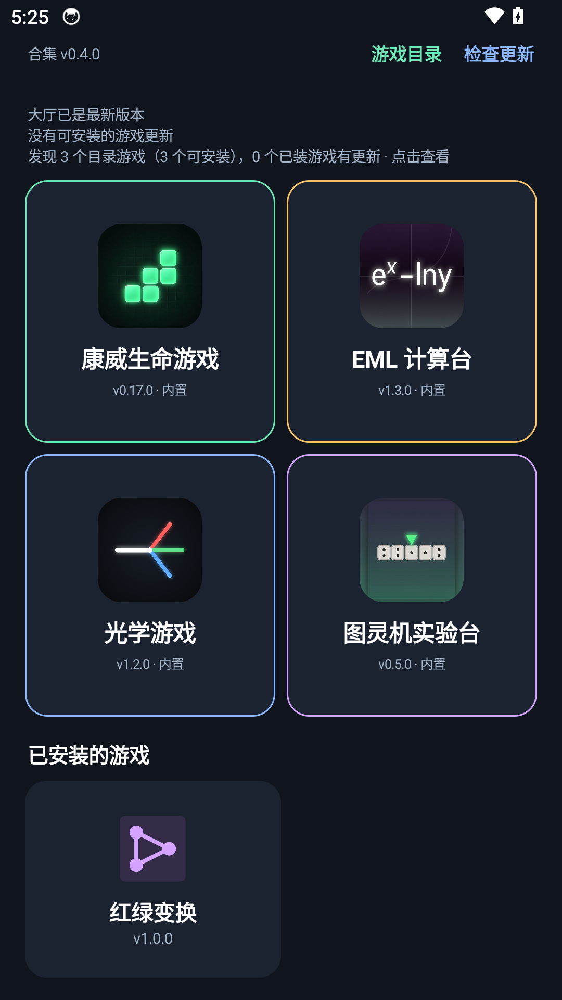
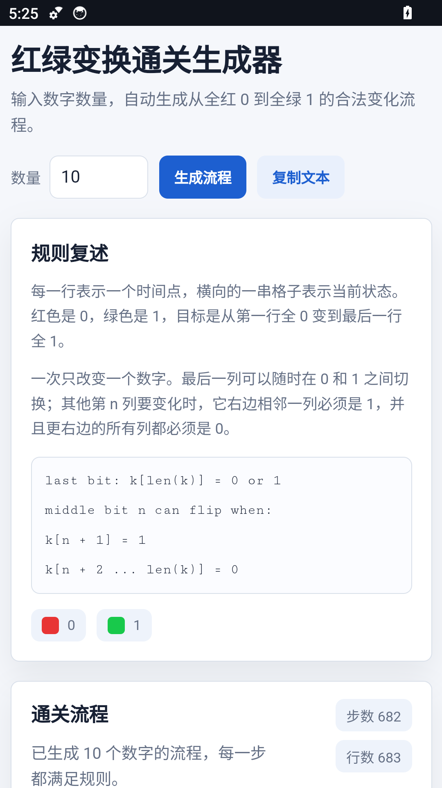

# N9-D 红绿变换资源发行与正式客户端验收

## 实际发行

- [资源通道](https://github.com/xiaoxuhui/game-hub/releases/tag/game-resources-v2) Release `407394942`，序列 **4**；目录资产 `625643138`，9,867 字节，SHA-256 `7a0312859ae27ccec42e737006a4deb46d57e7620cdd44dbfb8619a377bb17ac`。
- 新 ZIP 资产 `625642734`，`game-red-green-puzzle-1-81edc7c967f7.zip`，14,620 字节，SHA-256 `81edc7c967f7cdfabd1a1e8707b677ec0d930d63e12cc0b8d427f65261767c62`。
- 固定集成来源 `31eec2e638357d8e3e6a0550afc780e09bdaac49`，完整 MIT、冻结图灵上游与适配输出证明随包。已审干净发行检出 `538b16ee386be508050faccad5563195c618303e` 再生产/verify后签署，ZIP 与前两次完全同摘要。
- seq3原资产 `625249539` 仅改名 `catalog-seq3-69a34e189c35.signed.json`，7,935 字节与 SHA 保持。所有seq1～4签名、累计5 ZIP真实公网字节均通过既有严格 `resource-successor.mjs online` 校验，见 `n9-release/online-verified.json`。旧三游戏元数据/资产保持，目录共4游戏、9资产。
- v0.4.0 与 game-resources-v2 标签 peeled SHA 均仍 `4aacb1f81b7fc381d2ca7fd725fd93dd109e390e`；正式 APK 未重建/重新发布。资源 Release 的正文已同步序列4，prerelease/draft/tag属性保持。

## 失败与纠正留痕

首轮发布完成上传后，匿名在线阶段返回 `Public asset bytes mismatch` 并停止；已有 `published.json` 明确新目录资产/摘要。没有重新签署、重复上传、删除资产或重试发行器。只读查询规范及刷新参数的完整资产页面，二者都显示上述9资产；随后仅复跑原严格 `online` 模式，成功验证4份目录和5份累计ZIP。短暂读取差异与缓存传播一致，但未定位到最初具体响应，不宣称已证明缓存根因。首轮日志及只读成功日志均归档。

## 正式客户端实际操作

本轮自有 Android34 default x86_64 AVD `gamehub-n9-20261010` / `emulator-5566`，1080×1920、density420；安装的是已有正式 v0.4.0 APK原字节，不是调试/测试宿主。

1. 发布前启动显示3目录游戏。发布后正常“检查更新”读取4游戏，目录中显示“红绿变换 / v1.0.0 / 14 KiB”。主动点击“安装红绿变换”，下载校验后显示候选；正常点击打开激活，首页出现新卡片。
2. 默认数量6；实际触摸改为10并生成。UI层级实测 **683个独立t=行节点**，统计682步/683行、末行t=682及`1111111111`。不是只检查标签或伪造网页返回。
3. 实际改为11，生成后提示“请输入1到10之间的整数。上次有效流程保持不变。”，统计/旧流程仍为10位683行。其余非法输入、全部规模与最短路径见N9-B浏览器/领域测试，不把浏览器测试重复称为Android全部覆盖。
4. 正式WebView点击“复制文本”显示“已复制完整流程”。此项验证真实按钮和API成功反馈；未读取系统剪贴板全文。完整文本、失败后手动选择及不得虚报成功在N9-B浏览器强制失败/接收器和领域测试验证，真实手机剪贴板差异仍由使用者补验。
5. 杀进程后正常启动大厅，看到自动“查询中”，随后提醒3个尚未安装目录游戏（红绿已安装，不是目录回退）。首页卡片可打开红绿。
6. 仅关闭本轮AVD Wi-Fi/data，`dumpsys connectivity` 实际显示 `Active default network: none`。杀进程、启动、首页打开：恢复有效参数10、完整683行，再次触摸生成离线成功。先前输入11没有污染持久化参数。网页初载第一次UI层级尚无DOM时断言未通过；随后等待真实网页就绪再读完整节点并通过，未把空层级当通过。网络已恢复。
7. 执行原有明确 `productionResourceIdentity=true` 的正式身份 instrumentation：**OK (1 test)**，生产APK SHA、公钥SHA、hostCode4、激活id/contentCode/source/full archive hash/存储合同一致，ready=null、无active/state错误。附实际结果和日志，未更换公钥、输送假目录或放宽断言。

正式APK SHA `c6e071e18eac1cb97f3d898d6eb4dab2c790b8d9310a907a7e44e3c34a78ee39`；生产公钥 DER SHA `649107df10ad8f48e8da1d4f992fe652a63fea448fa17dce081b87333a892673`。其他Android版本/厂商真机与异机密钥恢复仍保留原待办，不把本模拟器验收代替用户真机。

N9-D 实际验收完成，提交后仍需独立审阅；本轮唯一过程目录的归档/清理继续N9-E。
