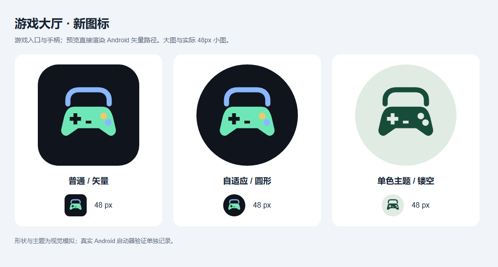

# 大厅图标改版：交付与审阅记录

- 日期：2026-10-03（Asia/Shanghai）
- 当前交付：正式图标源与 Android 接入完成；不含资源更新功能或新游戏实现，没有发行新版 APK。
- 需求与待办：[图标计划](大厅图标改版计划.md)、[分阶段版本待办](版本待办清单.md)。

## 1. 新图标

图案为蓝色入口轮廓和薄荷色手柄，深色背景，蓝/金色按键。未拼接四个子游戏标志，可沿用到未来动态扩展。使用原生矢量直接设计，保存 [SVG](../android/icon-source/game-hub-icon.svg) 和 [512px 导出](../android/icon-source/store-icon-512.png)，未使用生成模型或第三方图标。

普通 mipmap 用于 API24–25；v26 为自适应前景/背景；v33 加单色镂空层。Manifest 指向同名 mipmap，由系统选择；没有另设 roundIcon。四游戏卡片仍使用原图标。

## 2. 实际验证

资源实现提交：`de3607b3a6698834613f58a067b3ff932ec7ea55`。

| 验证 | 实际结果 |
|---|---|
| 独立 `node --test` | 13 通过，0 失败 |
| 独立四源组装/复核 | 固定四 SHA，40 资源，构建与 verify 退出 0 |
| 本机独立 `testDebugUnitTest assembleDebug` | BUILD SUCCESSFUL，13 JVM 测试，0 failures/0 errors |
| [实现提交 CI](https://github.com/xiaoxuhui/game-hub/actions/runs/37089765582) | completed/success，head_sha 与实现提交一致 |
| APK 图标/权限 | Manifest 选新 mipmap，v33 编译有 monochrome；包名与权限不变 |
| Android34 AOSP Launcher3 | 专用新模拟器安装 Success，应用列表显示新彩色图标，APP 可启动四卡大厅 |
| 形状/48px | 实际路径渲染的普通、圆形、单色可辨识，主要标志未截断；此为桌面模拟 |
| 主题模式 | 单色资源编译及预览通过；当前 AOSP 启动器无主题图标选项，实际主题模式**未验证** |
| 其他环境 | API24–25 及其他厂商启动器实际视觉未执行；普通 fallback 结构与 SDK 编译已核对 |

原始输出、截图、层级与复现说明见 [证据索引](evidence/icon-refresh/README.md)。仅测试候选 SHA-256 为 `17d8ead3fae1f044815435bf4f0374516e0e62b921af2675742b621fe35cbef2`，采用调试签名/code2，不是线上发行 APK。源码锁定、发行版本与 v0.2.0 标签未改变，不提供它覆盖正式安装的承诺。下一次正式发行须递增版本并用原发行证书重新构建签名。

## 3. 提交后审核与批改

### I0：`f4663cbde27c616baa66e60143ad004458ff0ff6`

独立只读审核 `/root/review_p2` 认为范围与三阶段待办清楚，可进入 I1；提出两个 P2：明确普通/v26/v33 的同名限定目录，避免旧设备读取 adaptive；主题图标不得用桌面预览代替运行时验收。

批改：I1 接入正确的三套限定资源且 Manifest 引用 mipmap；计划明确不设置 roundIcon。I04/I2 增加实际主题启动器的验收或如实未验证条件，当前环境无该能力，保留未验而不越过证据边界。

### I1：`de3607b3a6698834613f58a067b3ff932ec7ea55`

独立只读审核确认 Manifest、API 限定、SVG/Android 路径色值一致、单色 evenOdd 镂空和中心安全区域，无明显资源阻塞；预览各形态与 48px 可辨。

审核提醒 COMPLETE 仅表示资源代码已提交，构建/aapt 仍在进行，不得当成已验证。随后独立本机和 CI 构建、aapt、模拟器普通图标已完成，I1 才转 VERIFIED；I2 因实际主题模式未执行保持 COMPLETE，整个图标计划也不标全项 VERIFIED。主题模式可在未来支持的启动器补验，不阻止本轮资源交付。

## 4. 本轮终点与后续

本轮用户确认“只做图标，自动更新先规划”，并授权剩余工作无人值守。图标、回归、普通启动器检查、待办与记录完成并小步提交推送；四游戏资源更新 M1–M7 与新游戏动态扩展没有开始编码。未来按 [v0.3.0 计划](实施计划-v0.3.0.md)推进，主题与厂商启动器验收另补。未发布、未改变四个原仓库。
